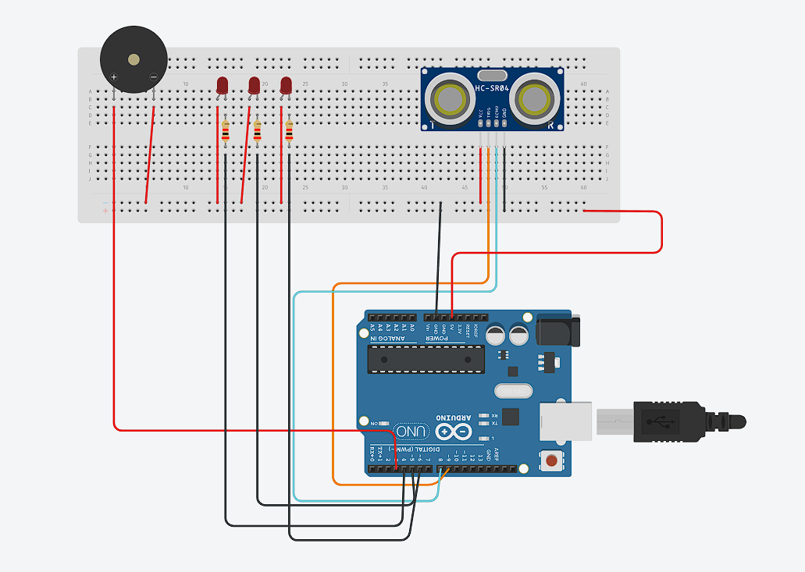
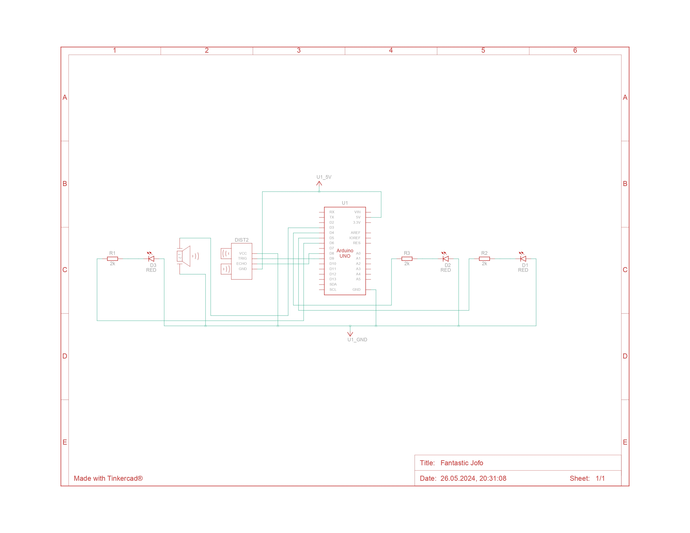

# Parking Sensor
|`Author`|
|-|
| Mirea Nino-Mario |

## Description
This Arduino project incorporates an LED that changes color based on the distance detected by an obstacle sensor. The sensor has a detection range of up to 15° within its field of view and can detect obstacles up to 50 centimeters away.

In the code, each individual distance measurement is transmitted via the serial port for testing purposes. Additionally, when an obstacle is detected within 100 cm (as defined by the constant beep_start), an acoustic signal is activated.

The frequency of the acoustic signals corresponds to the distance from the obstacle. Specifically, the interval between signals (in milliseconds) is determined by multiplying the distance (in centimeters) by 4. For instance, at a distance of one meter, an acoustic signal will be emitted every 400 milliseconds. This interval decreases as the distance shortens, with signals emitted more frequently. When the minimum distance threshold is reached (set to 5 cm in the code as min_distance), the acoustic signal becomes continuous.

Additionally, alongside these auditory cues, an LED visually indicates the distance by changing its color. As the distance decreases, the LED transitions through a spectrum of colors, providing a clear visual representation of proximity to obstacles.

## Motivation

Parking can be a challenging task, especially in tight or crowded spaces. Despite advances in vehicle technology, many cars on the road today lack sophisticated parking assistance systems. This project aims to address this gap by developing a cost-effective, easy-to-build parking sensor system using readily available components: an Arduino UNO, a buzzer, an ultrasonic sensor, and an LED.

## Architecture

### Hardware Pictures

### Schematic

### Components

| Device | Usage | Price |
|--------|--------|-------|
| Activ Buzzer | Buzzer | [1.5 RON](https://www.optimusdigital.ro/ro/audio-buzzere/635-buzzer-activ-de-3-v.html?search_query=buzzer&results=61) |
| Arduino UNO | Microprocesor | [1 RON](https://www.optimusdigital.ro/ro/butoane-i-comutatoare/1119-buton-6x6x6.html?search_query=buton&results=222) |
| Jumper Wires | Connecting components | [7 RON](https://www.optimusdigital.ro/ro/fire-fire-mufate/884-set-fire-tata-tata-40p-10-cm.html?search_query=set+fire&results=110) |
| Breadboard | Project board | [10 RON](https://www.optimusdigital.ro/ro/prototipare-breadboard-uri/8-breadboard-830-points.html?search_query=breadboard&results=145) |
| Ultrasonic sensor | Sensor |   [6.5 RON](https://www.optimusdigital.ro/ro/senzori-senzori-ultrasonici/9-senzor-ultrasonic-hc-sr04-.html?search_query=senzor+ultrasonic&results=44)    |
| Led | Led | [40 RON](https://www.optimusdigital.ro/ro/kituri/11970-set-led-uri-asortate-plusivo-500-buc-led-uri-100-buc-rezistoare-i-pcb-bonus.html?search_query=led&results=818) |

## Log

<!-- write every week your progress here -->

### Week 6 - 12 May
Found the project's subject.
### Week 7 - 19 May
Ordered the necessary hardware and started working on the code.
### Week 20 - 26 May
Assembled the hardware and finished the software side.

## Reference links

<!-- Fill in with appropriate links and link titles -->

[Arduino ProjectHub](https://projecthub.arduino.cc/)
